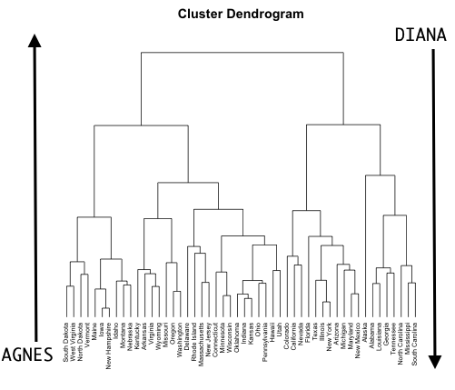
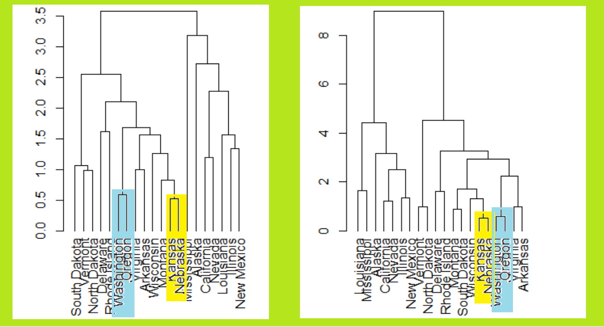

```{r setup, include=FALSE}
knitr::opts_chunk$set(echo = TRUE)
```

<style>
/* Your other css */
    body {
      background-image: url(https://wallpaperaccess.com/full/981549.jpg);
      background-position: center center;
      background-attachment: fixed;
      background-repeat: no-repeat;
      background-size: 100% 100%;
    }
.section .reveal .state-background {
    background-image: url(https://wallpaperaccess.com/full/981549.jpg);
    background-position: center center;
    background-attachment: fixed;
    background-repeat: no-repeat;
    background-size: 100% 100%;
}
</style>


<style>
div.green pre.r { background-color:lightgreen; }
</style>

<div class = "green">

# HIYERARSIK KUMELEME ANALIZI

Hiyerarsik kumeleme, veri kumesindeki gruplari tanimlamak icin k-means kumelemeye alternatif bir yaklasimdir. Uretilecek kumelerin sayisini k-means yaklasiminin gerektirdigi sekilde onceden belirtmemizi gerektirmez. Ayrica, hiyerarsik kumelemenin K-means kumelemeye gore ek bir avantaji vardir cunku dendrogram adi verilen gozlemlerin cekici bir agac temelli temsiliyle sonuclanir.

Kullanacagimiz paketler;

```{r message=FALSE, warning=FALSE}
library(cluster)    # kumeleme algoritmalari icin kullanilir
library(factoextra) # factoextra paketi butun bu algoritmalari ggplot2 destegi ile elegant gorseller olarak verebilmektedir.
library(dendextend) #iki dendrogrami karsilastirmak icin
library(ggdendro) #Bu, 'ggplot2' kullanarak dendrogramlar icin gorsellestirme paketidir.
library(ade4) #oklid kesif yontemleri cercevesinde ekolojik ve cevresel verileri analiz etmek icin veri analiz fonksiyonlari icerir
library(ggraph) #Ggplot2'de uygulanan grafik dilbilgisi, tablo veri girisine bagli olmasi nedeniyle grafik ve ag gorsellestirmeleri icin yetersizdir.Diger paketlerle destekliyoruz.
library(igraph) #ag analizi icin bir kutuphane. hem deterministik hem de stokastik grafikler olusturmak icin bir cok islev vardir.
library(tidyverse) # veri bilimi icin tasarlanmis r paketlerinden biridir.
library(dplyr) # tidyverse icinde bir pakettir.
library(RColorBrewer) #RColorBrewer, guzel grafikler olusturmak icin kullanima hazir renk paletleri iceren bir R paketidir. 
library(leaflet) # Etkilesimli Haritalar icin en populer acik kaynakli JavaScript kutuphanelerinden biridir.
library(maps) #Cografi haritalar icin R paketi.
library(pvclust) #Hiyerarsik kume analizindeki belirsizligi degerlendirmek icin cok olcekli bir bootstrap yeniden ornekleme uygulamasi. 
```

## HIYERARSIK KUMELEME ALGORITMALARI

Hiyerarsik kumeleme iki ana ture ayrilabilir: Aglomeratif ve Divisive .

- Aglomerasyon Kumeleme: AGNES (Aglomerasyon Yuvalama Birlestirme) olarak da bilinir. Asagidan yukariya dogru calisir. Yani, her nesne baslangicta tek elemanli bir kume (yaprak) olarak kabul edilir. Algoritmanin her adiminda, en cok benzeyen iki kume yeni bir buyuk kumede (dugumler) birlestirilir. Bu prosedur, tum noktalar tek bir buyuk kumenin (kok) uyesi olana kadar yinelenir . Sonuc, bir dendrogram agac diyagrami olarak grafiklenir.

- Divisive Hiyerarsik Kumeleme: DIANA (Bolunme Analizi) olarak da bilinir ve yukaridan asagiya dogru calisir. Algoritma AGNES'in ters sirasidir. Tum nesnelerin tek bir kumeye dahil edildigi kok ile baslar. Yinelemenin her adiminda, en heterojen kume ikiye ayrilir. Islem, tum nesneler kendi kumelerinde olana kadar yinelenir.

```{r echo=FALSE, message=FALSE, warning=FALSE}

```

Ancak, daha buyuk bir soru sudur: Iki gozlem kumesi arasindaki farkliligi nasil olceriz? Bu soruyu cevaplamak icin bir dizi farkli kume aglomerasyon yontemi (yani baglanti yontemleri) gelistirilmistir.

En yaygin yontem tipleri sunlardir:

**Maksimum veya tam baglanti kumeleme: ** Kume 1'deki elemanlar ile kume 2'deki elemanlar arasindaki tum cift farkliliklari hesaplar ve bu farkliliklarin en buyuk degerini (yani, maksimum degeri) iki kume arasindaki mesafe olarak kabul eder. Daha kompakt(yogun) kumeler uretme egilimindedir.

**Minimum veya tek baglanti kumeleme:** Kume 1'deki elemanlar ile Kume 2'deki elemanlar arasindaki tum cift farkliliklari hesaplar ve bu farkliliklarin en kucugunu bir baglanti kriteri olarak gorur. Uzun, “gevsek” Kumeler uretme egilimindedir.

**Ortalama veya ortalama baglanti kumelemesi:** Kume 1'deki elemanlar ile kume 2'deki elemanlar arasindaki tum cift farkliliklari hesaplar ve bu farkliliklarin ortalamasini iki kume arasindaki mesafe olarak kabul eder.

**Centroid baglanti kumelemesi:** Kume 1 icin sentroid (uzunluk p degiskenlerinin ortalama vektoru) ile kume 2 icin sentroid arasindaki farkliligi hesaplar.

**Ward'in minimum varyans yontemi:** Toplam kume ici varyansini en aza indirir. Her adimda, kume arasi minimum mesafeye sahip kumeler cifti birlestirilir.

Ek Yorumlar:

 Kumeleme denetimsiz ortamda veri analizi icin cok yararli bir arac olabilir. Ancak, kumeleme gerceklestirirken ortaya cikan sorunlar vardir.
 
 Hangi farklilik olcusu kullanilmalidir ?
 Ne tur bir baglanti kullanilmalidir?
 Kumeler elde etmek icin dendrogrami nerede kesmeliyiz?
 
 Bu sorunlar ile karsi karsiya geldigimizde hiyerarsik kumeleme durumundan endise duymaliyiz.
 
 Bu kararlarin her birinin elde edilen sonuclar uzerinde guclu bir etkisi olabilir. Uygulamada, birkac farkli secenek deniyoruz ve en kullanisli veya yorumlanabilir cozume sahip olani ariyoruz. Bu yontemlerle, tek bir dogru cevap yoktur.Verilerin bazi ilginc yonlerini ortaya koyan herhangi bir cozum dikkate alinmalidir.
 
### BASIT BIR ORNEK ILE KONUMUZU ANLATALIM

```{r message=FALSE, warning=FALSE}
hf <- data.frame(
  x1 = c(-1.5, -1.3, -.9, -.6, .1, .1, .6, 1.2, 1.4),
  x2 = c(-.4, -1.5, -1.2, -1, -1.1, .6, -.2, -.5, -.3),
  label = c(3, 4, 6, 1, 2, 9, 8, 5, 7),
  row.names = c(3, 4, 6, 1, 2, 9, 8, 5, 7)
)
highlight <- filter(hf, label %in% c(2 ,9))
p1 <- ggplot(hf, aes(x1, x2, label = label)) +
  geom_label() +
  geom_label(data = highlight, fill = 'yellow')
hf <- data.frame(
  x1 = c(-1.5, -1.3, -.9, -.6, .1, .1, .6, 1.2, 1.4),
  x2 = c(-.4, -1.5, -1.2, -1, -1.1, .6, -.2, -.5, -.3),
  row.names = c(3, 4, 6, 1, 2, 9, 8, 5, 7)
)
p2 <- factoextra::fviz_dend(hclust(dist(hf)))
gridExtra::grid.arrange(p1, p2, nrow = 1)
```

Cluster Dendrogramimiza baktigimizda 5. ve 7. gozlem birbirine benzedigi icin bir kumede birlestirilmistir.
Mesafe bakimindan bu kumeye en yakin 8. gozlemdir ve bu kume ile birlestirilmistir.
Sonra mesafe bakimindan ikinci en yakin gozlemimiz 2.gozlemdir ve bu kume ile birlestirilir.
Daha sonra mesafe bakimindan ucuncu en yakin gozlemimiz 9. gozlemdir ve bu kume ile birlestirilerek daha buyuk bir kume olusturulmustur.

 1. ve 6. gozlem birbirine benzedigi icin bir kumede birlestirilmistir.
Mesafe bakimindan bu kumeye en yakin 4. gozlemdir ve bu kume ile birlestirilmistir.
Sonra mesafe bakimindan ikinci en yakin gozlemimiz 3.gozlemdir ve bu kume ile birlestirilerek daha buyuk bir kume olusturulmustur.

Sonuc olarak olusturulan bu iki ayri kume birbirleriyle birlestirince diger kumelere gore daha heterojen ve daha buyuk bir kume elde edilmistir.

Simdi esas uzerinde calisacagimiz veriye gecelim;

```{r eval=FALSE, message=FALSE, warning=FALSE, include=FALSE}
library(readr)
USArrests<- read.csv("C:/Users/ASUS/Desktop/istyazılımfinal/datasets_11570_16000_USArrests.csv",header = T)
USArrests
```

## VERI HAZIRLAMA

Genel olarak R'de bir kume analizi yapmak icin, veriler asagidaki gibi hazirlanmalidir:

Verilerdeki eksik degerler kaldirilmali veya tahmin edilmelidir.
Degiskenleri karsilastirilabilir hale getirmek icin veriler standartlastirilmalidir (yani olceklendirilmelidir). Standardizasyonun degiskenleri ortalama 0 ve standart sapma 1 olacak sekilde donusturmekten ibaret oldugunu hatirlayin.(Scale kodu ile yapiyoruz)

Burada, USArrests1973'te 50 ABD eyaletinin her birinde saldiri, cinayet ve tecavuz icin tutuklama istatistiklerini iceren veri setini kullanacagiz . Ayni zamanda kentte yasayan nufusun yuzdesini de iceriyor.

- Degiskenler:

**Murder:** Cinayet istatistigi

**Assault:** Saldiri istatistigi

**UrbanPop:** Kentsel populasyon 

**Rape:** Tecavuz istatistigi

```{r message=FALSE, warning=FALSE}

m <- leaflet() %>%
  addTiles() %>%  # Add default OpenStreetMap map tiles
  addMarkers(lng=174.768, lat=-36.852, popup="The birthplace of R")

m <- leaflet()
m <- addTiles(m)
m <- addMarkers(m, lng=174.768, lat=-36.852, popup="The birthplace of R")


mapStates = map("state", fill = TRUE, plot = FALSE)
leaflet(data = mapStates,options = leafletOptions(minZoom = 0, maxZoom = 18)) %>% addTiles() %>%
  addPolygons(fillColor = topo.colors(10, alpha = NULL), stroke = FALSE)

```


```{r message=FALSE, warning=FALSE}
data(USArrests)
df <- USArrests
```

Verimiz de eksik gozlem olup olmadigini kontrol edelim;

```{r message=FALSE, warning=FALSE}
library(DataExplorer) # introduce fonksiyonunu calistirmak icin kullanilan paket
introduce(df)
```

total_missing_values' in 0 cikmasi verimizde eksik gozlem olmadigi anlamina gelmektedir. Bu sebeple verimizden eksik gozlemleri kaldirmamiza gerek yoktur. (df <- !is.na(df) eger eksik gozlemleri cikarmak isteseydik bu kodu uygulayacaktik.)

Kumeleme algoritmasinin rasgele degiskeninin bir birine bagimli olmasini istemedigimizden, R islevini kullanarak verileri olceklendirerek (standartlastirarak) baslariz. 

```{r message=FALSE, warning=FALSE}
df <- scale(df)
```

# R ILE HIYERARSIK KUMELEME 

Hiyerarsik kumelemeyi hesaplamak icin R'de farkli islevler vardir. Sik kullanilan islevler:

hclust (Library Stats) ve agnes (Library Cluster) , aglomeratif hiyerarsik kumeleme icin kullanilirlar.

diana (Library Cluster) bolucu hiyerarsik kumeleme icin kullanilirlar.

## AGLOMERATIF HIYERARSIK KUMELEME 

Once verimiz icin yapacaklarimizin basit bir ornegini gosterelim;

### BASIT BIR DENDROGRAM OLUSTURMAK 

```{r message=FALSE, warning=FALSE}
dend <- df[1:5,] %>% scale %>% dist %>% 
   hclust %>% as.dendrogram %>%
   set("branches_k_color", k=3) %>% set("branches_lwd", 1.2) %>%
   set("labels_colors") %>% set("labels_cex", c(.9,1.2)) %>% 
   set("leaves_pch", 19) %>% set("leaves_col", c("blue", "red"))

dend %>% plot

dend %>% set("labels", c("a", "b", "c", "d", "e")) %>% plot #Etiketleri degistirmek istersek
```

Dendrogramimiza baktigimizda;
Arizona ve California gozlemleri birbirlerine benzerlik acisindan en yakin oldugundan bir kumede toplanmistir.
Daha sonra Alaska gozlemi bu olusturdugumuz kumeye benzerlik bakimindan yakin oldugu icin bu kume ile birlestirilerek daha buyuk bir kume elde edilmistir.

Alabama ve Arkansas gozlemleri birbirlerine benzerlik acisindan en yakin oldugundan bir kumede toplanmistir.
Sonuc olarak bu iki ayri kume birlestirirerek daha buyuk heterojen bir kume olusmustur.

```{r message=FALSE, warning=FALSE}
#Dugum noktalarinin turunu, rengini ve boyutunu degistirin

dend %>% set("nodes_pch", 19) %>%  # dugum noktasi turu
  set("nodes_cex", 2) %>%  # dugum noktasi boyutu
  set("nodes_col", "orange") %>% # dugum noktasi rengi
  plot(main = "Dugum Noktalari")
abline(h = 2, lty = 2)


# Her kume icin farkli nokta turleri ve renkleri ekleyelim;
dend %>% set("leaves_pch", c(17, 18, 19,20)) %>% 
  set("leaves_cex", 2) %>%  
  set("leaves_col", c("blue", "red", "green")) %>% 
  plot(main = "Yaprak noktalari")
```

Renkli dikdortgenler ekleme;

```{r message=FALSE, warning=FALSE}
dend %>% set("branches_k_color", k = 3) %>% plot
dend %>% rect.dendrogram(k=3, border = 8, lty = 5, lwd = 2)

dend %>% set("branches_k_color", k = 3) %>% plot(horiz = TRUE)
dend %>% rect.dendrogram(k = 3, horiz = TRUE, border = 8, lty = 5, lwd = 2)
```

Simdi bu gosterdiklerimizin daha complex haline bakalim.

Hiyerarsik kumeleme yaparken uretilecek kume sayisini onceden belirtmek gerekli degildir.
Kume sayisina dendrogramlar yardimi ile karar veriyoruz fakat is ihtiyacina gore kac kume istediginize onceden karar vermeniz gerekiyorsa asagidaki yontemleri uygulayabilirsiniz.

## OPTIMAL KUMELEME BELIRLENMESI(Determining Optimal Clusters)

Optimum kume sayisini belirlemek icin kullanilacak yontem.
FUNcluster: Bir bolumleme islevi. Izin verilen degerler kmeans, pam, clara ve hcut (hiyerarsik kumeleme icin) icerir.
Asagidaki kodlarimiz hcut kumelemesi icin optimum kume sayisini belirler;

### Dirsek Yontemi(Elbow Method)

Dirsek yontemini gerceklestirmek icin fviz_nbclust'daki ikinci argumani FUN = hcut olarak degistirmemiz yeterlidir.

```{r message=FALSE, warning=FALSE}
fviz_nbclust(df, hcut, method = "wss")+geom_vline(xintercept = 4,linetype = 2)+labs(subtitle = "Elbow method")
```

k kumeleme sayimiz arttikca kareler toplami dusmektedir. 

### Ortalama Siluet Yontemi(Average Silhouette Method)

Ortalama siluet yontemini gerceklestirmek icin benzer bir sureci takip ediyoruz.

```{r message=FALSE, warning=FALSE}
fviz_nbclust(df, FUN = hcut, method = "silhouette")
```

### Bosluk Istatistik Yontemi (Gap Statistic Method)

Surec gap istatistik yontemini gerceklestirmek icin oldukca benzerdir.

n start = 25’i belirtiyoruz. Bu, R’nin 25 farkli rastgele baslangic atamalarini deneyecegi ve daha sonra kume varyasyonunda en dusuk olana karsilik gelen en iyi sonuclari sececegi anlamina gelir. N in baslangictaki varsayilan degeri birdir.

```{r message=FALSE, warning=FALSE}
gap_stat <- clusGap(df, FUN = hcut, nstart = 25,K.max = 10, nboot = 50)
fviz_gap_stat(gap_stat)
```

```{r message=FALSE, warning=FALSE}
gap_stat <- clusGap(df, FUN = hcut, nstart = 25, K.max = 10, B = 50)
p1<-fviz_gap_stat(gap_stat)+
                    ggtitle("Bosluk Istatistik Yontemi")

p2<-fviz_nbclust(df, FUN = hcut, method = "silhouette")+
  ggtitle("Ortalama Siluet Yontemi")

p3<-fviz_nbclust(df, hcut, method = "wss")+geom_vline(xintercept = 4,linetype = 2)+
  ggtitle("Dirsek Yontemi")

gridExtra::grid.arrange(p1, p2, p3, nrow = 1)
```

Silhouette yontemi ile olusturulan kume optimal sayisi yukarida goruldugu gibi 2 oldu,  WSS(dirsek yontemi) yontemi ile olusturulan kume optimal sayisi yukarida goruldugu gibi 4 oldu ve Bosluk Istatistik Yontemi(Gap Statistic Method) kumelerin optimum sayisi 4 oldu .

Dirsegin ve ortalama siluet yontemlerinin dezavantaji, sadece kuresel bir kumelenme ozelligini olcmeleridir. Daha karmasik bir yontem, optimal kume sayisini tahmin etmek icin dirsegin ya da siluetin sezgiselligini resmilestirmek icin istatistiksel bir prosedur saglayan bosluk istatistigi kullanmaktir.

```{r message=FALSE, warning=FALSE}
set.seed(123)
gap_stat <- clusGap(df, FUN = hcut, nstart = 25,K.max = 10, B = 50)

print(gap_stat, method = "firstmax")
```

Bosluk Istatistik Yontemi (Gap Statistic Method) ile kumelerin optimum sayisi 4 oldugundan k=4 alinmali.


Biz complete, single ve average olarak 3 yontemi kullanacagiz.

### Method 1 - Complete linkage

```{r message=FALSE, warning=FALSE}

data <- dist(df, method = "euclidean")

datahc <- hclust(data, method = "complete")
dataas <- cutree(datahc, k = 4)


sil <- silhouette(dataas, data)
fviz_silhouette(sil,palette= "jco",ggtheme = theme_minimal())
```

k=4 alarak olusturdugumuz kumelerde 2. ve 4. grupta  gozle gorulur yanlis eslesme yoktur.Fakat 1. ve 3. gruba baktigimizda ufak ta olsa negatif (yanlis) eslesme gorulmektedir.

### Method 2 - Single linkage

```{r message=FALSE, warning=FALSE}
#single
datahc <- hclust(data, method = "single")
dataas <- cutree(datahc, k = 4)

sil <- silhouette(dataas, data)
fviz_silhouette(sil,palette= "jco",ggtheme = theme_minimal())
```

Ortalama siluet puaninin uzerindeki grafikte goruldugu gibi daha dusuktur ve gozlemlerin cogu mavi kumeye girmistir. Ayrica, cok sayida gozlemin dogru kumede olmadigini gosteren yuksek bir negatif puan da vardir.

### Method 3 - Average linkage

```{r message=FALSE, warning=FALSE}
#average
datahc <- hclust(data, method = "average")
dataas <- cutree(datahc, k = 4)

sil <- silhouette(dataas, data)
fviz_silhouette(sil,palette= "jco",ggtheme = theme_minimal())
```

Ortalama siluet puaninin uzerindeki grafikte goruldugu gibi daha yuksektir ve sadece kirmizi  kume minimum negatif puan gosterir. Negatif puan hafif bir yanlis siniflandirmayi gosterir. Bu, dogru kumede olmadiklari anlamina gelir.

### FINAL CLUSTER

```{r message=FALSE, warning=FALSE}
res.hc <- eclust(df, "hclust",hc_metric = "euclidean",hc_method = "complete",k=4)
fviz_silhouette(res.hc,palette= "jco",ggtheme = theme_minimal())
```

k=4 alarak olusturdugumuz kumelerde 2. ve 4. grupta  gozle gorulur yanlis eslesme yoktur.Fakat 1. ve 3. gruba baktigimizda ufak ta olsa negatif (yanlis) eslesme gorulmektedir.

Ilk olarak benzerlik degerlerini hesaplayip, dist ile benzerlik degerlerini hesaplariz. Sonra bu degerleri hclust kullanilarak aglomerasyon yontemiyle (yani “complete”, “average”, “single”, “ward.D”) siralariz. Daha sonra dendrogrami cizebiliriz.

```{r message=FALSE, warning=FALSE}
# Farklilik matrisi
d <- dist(df, method = "euclidean") # oklid metodunu secelim

#Complete Linkage kullanarak hiyerarsik kumeleme
hc1 <- hclust(d, method = "complete" ) 
# Elde edilen dendrogrami cizdirelim
plot(hc1, cex = 0.6, hang = -1)
```

Yukaridaki dendrogram argumanlar kullanilarak ozellestirilebilir:

```{r message=FALSE, warning=FALSE}
# Farklilik matrisi
d <- dist(df, method = "euclidean") # oklid metodunu secelim

#Complete Linkage kullanarak hiyerarsik kumeleme
hc1 <- hclust(d, method = "complete" ) 
hcd <- as.dendrogram(hc1)

ggdendrogram(hcd, rotate = TRUE, theme_dendro = FALSE)

# nodePar tanimlayalim; 
nodePar <- list(lab.cex = 0.6, pch = c(NA, 19), 
                cex = 0.7, col = "orange")

# Etiketleri kaldirirsak;
plot(hcd, ylab = "Height", nodePar = nodePar, leaflab = "none")

# Horizontal plot cizdirelim; 
plot(hcd,  xlab = "Height",
     nodePar = nodePar, horiz = TRUE)

source("http://addictedtor.free.fr/packages/A2R/lastVersion/R/code.R")
op = par(bg = "gray15")
cols = hsv(c(0.2, 0.57, 0.95,0.85), 1, 1, 0.8)
A2Rplot(hc1, k = 4, boxes = FALSE, col.up = "gray50", col.down = cols)

# Kenar rengini degistirelim;
op = par(bg = "honeydew")  #Arka plana renk ekleme
 plot(hcd,  xlab = "Height", nodePar = nodePar, 
     edgePar = list(col = 2:3, lwd = 2:1))
#  axis ekleyelim;
axis(side = 2, at = seq(0, 400, 100), col = "cyan", labels = FALSE,   #Yan tarafa cizgi ekleme
    lwd = 2)
abline(h = 4, lty = 4)

# Cok gozlemli olan verilerde dendrogrami okumak zor olabilir. Bu kod ile dendrogramda istedigimiz bolumu yakinlastirabiliriz.
hcd1 <- as.dendrogram(hc1 )
plot(hcd1,xlab = "Height", nodePar = nodePar, 
     edgePar = list(col = 2:3, lwd = 2:1) ,xlim = c(1,10), ylim = c(1,20))

#Gorsellestirelim;

```

Dusey formdaki bir dendogram basasagi bir agac seklindedir. En altta yapraklar olarak veriseti elemanlari bulunur. Agacta yukariya dogru cikildikca birbirine benzer olan gozlemler dallar halinde birlesmeye baslarlar. Bunlar da daha ust duzeylerde birlesirler. Dusey eksende gozlenen birlesim yuksekligi elemanlarin benzemezliginin gostergesidir. Daha uzun bir dal daha az benzeyen elemana karsi gelir. Birlesmis iki elemanin ne kadar benzer veya benzemez oldugu sadece dal yuksekliginden anlasilir. Yatay eksendeki pozisyonlar benzerligi yansitmazlar. Alt gruplari belirlemek icin dendogram belirli bir yuksekliten kesilebilir.

Yakinlastirilmis Dendrogramimizda da goruldugu gibi;
P1) Lowa ve New Hampshire birbirine en yakin gozlem oldugu icin ayni kumede birlestirilmistir.
P2)Bu kumeye en yakin gozlem Maine oldugu icin ,Maine de bu kume ile birlestirilmistir. 

P1 ile P2 birlestirilince C1.

P4) Montana ve Nebraska birbirine en yakin gozlem oldugu icin ayni kumede birlestirilmistir.
P5)Bu kumeye en yakin gozlem Idaho oldugu icin ,Idaho de bu kume ile birlestirilmistir.

P4 ile P5 birlestirince C2.

C1 ile C2 birlestirirsek C3 olusur.

P3)Sonra ayri bir kume olarak South Dakota ve West Virginia  birbirine en yakin gozlem oldugu icin ayni kumede birlestirilmistir.
P6)North Dakota ve Vermont birbirine en yakin gozlem oldugu icin ayni kumede birlestirilmistir.
Bu birlestirilen iki kume birbirine yakin oldugu icin kendi aralarinda tekrar kumelenmistir.

P3 ile P6 birlestirince C4 olur.

Son olarak C3 ile C4 birlestirilir ve C5 olusur.

Simdi bu dendrogramlarimizi farkli sekillerde gosterelim;

```{r message=FALSE, warning=FALSE}
labelColors = c("#CDB380", "#036564", "#EB6841", "#EDC951")

clusMember = cutree(hcd, 4)
# Renk etiketleri almak icin fonksiyon
colLab <- function(n) {
    if (is.leaf(n)) {
        a <- attributes(n)
        labCol <- labelColors[clusMember[which(names(clusMember) == a$label)]]
        attr(n, "nodePar") <- c(a$nodePar, lab.col = labCol)
    }
    n
}

clusDendro = dendrapply(hcd, colLab)

op = par(bg = "mintcream") #Arka plana renk ekleme
plot(clusDendro, main = "Dendrogram", type = "triangle")
#  axis ekleyelim;
axis(side = 2, at = seq(0, 400, 100), col = "cyan", labels = FALSE, #Yan tarafa cizgi ekleme
    lwd = 2)

# Cok gozlemli olan verilerde dendrogrami okumak zor olabilir. Bu kod ile dendrogramda istedigimiz bolumu yakinlastirabiliriz.
plot(clusDendro, main = "Dendrogram", type = "triangle",xlim = c(32,34), ylim = c(1,20))
```

Yakinlastirdigimiz Dendrogramda goruldugu gibi;
California ve Nevada birbirine en yakin gozlem oldugu icin ayni kumede birlestirilmistir.
Bu kumeye en yakin gozlem Colorado oldugu icin ,Colorado da bu kume ile birlestirilmistir ve daha buyuk bir kume yapilir. 

```{r message=FALSE, warning=FALSE}
library(ape)
require("igraph") 
fviz_dend(hc1, k=4, k_colors = "jco", type = "phylogenic", repel = TRUE)

```

Bu bir flogenetik agactir.Biz bunu verimiz icin basit bir sekilde gosterdik. Bu grafik turu genetik alaninda kullanilabilir.

```{r message=FALSE, warning=FALSE}
op = par(bg = "azure")  #Arka plana renk ekleme
colors = c("purple", "blue", "red", "orange")
clus4 = cutree(hc1, 4)
plot(as.phylo(hc1), type = "radial",tip.color = colors[clus4],edge.color =colors[clus4],
     label.offset = 1, cex = 0.7)

fviz_dend(hc1, cex = 0.5, k=4, k_colors = "jco", type = "circular")

dend <- hc1 %>% as.dendrogram %>%
   set("branches_k_color", k=3) %>% set("branches_lwd", 1.2) %>%
   set("labels_colors") %>% set("labels_cex", c(.9,1.2)) %>% 
   set("leaves_pch", 19) %>% set("leaves_col", c("blue", "red"))

ggd1 <- as.ggdend(dend)
ggplot(ggd1, labels = TRUE) +
  scale_y_reverse(expand = c(0.05, 0)) +
  coord_polar(theta="x")
```

```{r message=FALSE, warning=FALSE}
res.hclust<-df %>% dist() %>% hclust() 
  res.tree<-as.dendrogram(res.hclust)
  
ggraph(res.tree,layout="dendrogram")+
  geom_edge_diagonal(color="purple")+
  geom_node_text(aes(label=label),angle=90,hjust=1,size=3,color="orange")+ylim(-1.5,NA)+theme_test()

```

# AGNES

Alternatif olarak, *agnes* fonksiyonu kullanabiliriz . Bu islevler cok benzer sekilde davranir; bununla birlikte, agnes fonksiyonla, bulunan kumeleme yapisinin miktarini olcen aglomerasyon katsayisini da alabilirsiniz (1'e yakin degerler guclu kumeleme yapisini gosterir).

```{r message=FALSE, warning=FALSE}
# Agnes ile complete methodunu kullanalim
hc2 <- agnes(df, method = "complete")

# Aglomeratif katsayisi
hc2$ac
```

Aglomeratif katsayisi 0.8531583 cikmistir.1'e yakin oldugu icin guclu kumeleme yapisini gosterir.

Bu, daha guclu kumeleme yapilarini tanimlayabilen belirli hiyerarsik kumeleme yontemlerini bulmamizi saglar. 

```{r message=FALSE, warning=FALSE}
# Degerlendirme Yontemleri 4 tanedir 
m <- c( "average", "single", "complete", "ward")
names(m) <- c( "average", "single", "complete", "ward")

# Katsayiyi hesaplamak icin islev
ac <- function(x) {
  agnes(df, method = x)$ac
}
map_dbl(m, ac)
```

Burada Ward'in yonteminin, degerlendirilen dort yontemin en guclu kumeleme yapisini belirledigini goruyoruz.

```{r message=FALSE, warning=FALSE}
hc3 <- agnes(df, method = "ward") # ward metodunu alarak dendrogram olusturalim

 dend9 <- as.dendrogram(hc3) #renklendirme 
 dend10 <- dend9 %>%
          color_branches(k = 4) %>%
          set("branches_lwd", c(2,1,2)) %>%
          set("branches_lty", c(1,2,1)) %>%
   color_labels( k = 4) #Etiketleri renklendirme
 
op = par(bg = "oldlace")  #Arka plana renk ekleme
 plot(dend10,main=" ward Dendrogram ")
  axis(side = 2, at = seq(0, 400, 100), col = "mediumaquamarine", labels = FALSE, #Yan tarafa cizgi ekleme
    lwd = 2)
 
# Cok gozlemli olan verilerde dendrogrami okumak zor olabilir. Bu kod ile dendrogramda istedigimiz bolumu yakinlastirabiliriz.
hcd3 <- as.dendrogram(hc3)
 dend11 <- hcd3 %>%
          color_branches(k = 4) %>%
          set("branches_lwd", c(2,1,2)) %>%
          set("branches_lty", c(1,2,1)) %>%
   color_labels( k = 4)

op = par(bg = "oldlace")  #Arka plana renk ekleme
 plot(dend11,main="ward Dendrogram" ,xlim = c(1, 4), ylim = c(1,14))
 axis(side = 2, at = seq(0, 400, 100), col = "mediumaquamarine", labels = FALSE, #Yan tarafa cizgi ekleme
    lwd = 2)


```

AGNES asagidan yukariya dogru calisir. Yani, her nesne baslangicta tek elemanli bir kume (yaprak) olarak kabul edilir. Algoritmanin her adiminda, en cok benzeyen iki kume yeni bir buyuk kumede (dugumler) birlestirilir. Bu prosedur, tum noktalar tek bir buyuk kumenin (kok) uyesi olana kadar yinelenir.

Ikinci grafikte daha yakinlastirarak baktgimizda;
Alabama ve Louisiana birbirine en cok benzeyen iki gozlemdir. Bu sebeple bir kumede toplanmistir. 
Georgia ve Tennessee birbirine en cok benzeyen iki gozlemdir. Bu sebeple bir kumede toplanmistir.
Bu iki ayri kume birbirine benzer oldugu icin bir kumede birlestirilmistir ve daha buyuk bir kumede toplanmistir.

# DIANA

Diana Kume paketi tarafindan saglanan R islevi , bolucu hiyerarsik kumeleme yapmamizi saglar.

```{r message=FALSE, warning=FALSE}
# Divisive ile hiyerarsik kumeleme hesaplama
hc4 <- diana(df)

hc4$dc
```

Divisive katsayimiz 0.8514345 cikmistir.1'e yakin oldugu icin guclu kumeleme yapisini gosterir. 

```{r message=FALSE, warning=FALSE}

 dend12 <- as.dendrogram(hc4) #renklendirme 
 dend13 <- dend12 %>%
          color_branches(k = 4) %>%
          set("branches_lwd", c(1,2,1)) %>%
          set("branches_lty", c(1,2,1)) %>%
   color_labels( k = 4) #Etiketleri renklendirme
 
op = par(bg = "lavenderblush")  #Arka plana renk ekleme
 plot(dend13, main = "Dendrogram of diana")
  axis(side = 2, at = seq(0, 400, 100), col = "yellow", labels = FALSE, #Yan tarafa cizgi ekleme
    lwd = 2)
  
  
 op = par(bg = "lavenderblush")  #Arka plana renk ekleme
 plot(dend13, main = "Dendrogram of diana", xlim = c(1, 7), ylim = c(1,14))
  axis(side = 2, at = seq(0, 400, 100), col = "yellow", labels = FALSE, #Yan tarafa cizgi ekleme
    lwd = 2)
```

DIANA yukaridan asagiya dogru calisir. Algoritma AGNES'in ters sirasidir. Tum nesnelerin tek bir kumeye dahil edildigi kok ile baslar. Yinelemenin her adiminda, en heterojen kume ikiye ayrilir. Islem, tum nesneler kendi kumelerinde olana kadar yinelenir.

Kume cizgileri ne kadar uzun ise o kadar heterojen yapiya sahiptir. Kume cizgileri kisaldikca kumelerin birbiri ile benzerligi artar ve homojen hale donusur.

Yukarida gosterilen dendrogramda, her yaprak bir gozleme karsilik gelir. Agaci yukari dogru hareket ettirdikce, birbirine benzer gozlemler, daha yuksek bir yukseklikte kaynasmis dallara birlestirilir.

Dikey eksende saglanan fuzyonun yuksekligi, iki gozlem arasindaki (dis) benzerligi gosterir. Fuzyonun yuksekligi ne kadar yuksek olursa, gozlemler o kadar az benzerdir. Iki gozlemin yakinligina iliskin sonuclarin, yalnizca bu iki gozlemi iceren dallarin ilk kaynastigi yukseklige dayanarak alinabilecegini unutmayin. Iki gozlemin yakinligini yatay eksen boyunca benzerliklerinin bir olcutu olarak kullanamayiz.

Yakinlastirilmis Grafige baktigimizda;

Alabama ve Tennessee birbirine en cok benzeyen iki gozlemdir. Bu sebeple bir kumede toplanmistir. 
Georgia ve Louisiana birbirine en cok benzeyen iki gozlemdir. Bu sebeple bir kumede toplanmistir.
Bu iki ayri kume birbirine benzer oldugu icin birlestirilmistir.

Mississippi ve South Carollina birbirine en cok benzeyen iki gozlemdir. Bu sebeple bir kumede toplanmistir.
Bu kumeye de North Carollina benzer oldugundan bu kume ile birlestirilmistir.
Bu iki ayri kume birbirine benzer oldugu icin bir kumede birlestirilmistir.

En son olusan iki ayri kume birbirine benzer oldugundan bu kumeler de birlestirilmistir.

Kesimin dendrograma yuksekligi, elde edilen kumelerin sayisini kontrol eder. K-kumeleme anlaminda k ile ayni rolu oynar. Alt gruplari (yani kumeler) tanimlamak icin dendrogrami asagidakilerle kesebiliriz:

```{r message=FALSE, warning=FALSE}
# Ward's methodu
hc5 <- hclust(d, method = "ward.D2" )

# Agaci 4 gruba ayirir
sub_grp <- cutree(hc5, k = 4)

# Her kumedeki uye sayisini verir
table(sub_grp)
```

Yukaridaki dendrogramimizda 4 kol vardir.Sirasiyla bu kollara denk gelen gozlem sayilari 7,12,19 ve 12 dir.

Her bir gozlemin ait oldugu kumeyi orijinal verilerimize eklemek icin cutree ciktisini da kullanabiliriz.

```{r message=FALSE, warning=FALSE}
USArrests %>%
  mutate(cluster = sub_grp) %>%
  head
```

Yukaridaki dendrogramda kumeleri daha kolay gorebilmek icin Dendrogram da 4 kumenin etrafina bir kenarlik cizelim.
Daha guzel gorsellestirmek icin renklendirme yapalim.

```{r message=FALSE, warning=FALSE}
plot(hc5, cex = 0.6)
rect.hclust(hc5, k = 4, border = 2:5)

hc6 <- hclust(d, method = "ward.D2")

fviz_dend(hc6, k = 4,                 
          cex = 0.5,horiz = TRUE,                 
          k_colors = c("#2E9FDF", "#bb0038", "#E7B800", "#FC4E07"),
          color_labels_by_k = TRUE,  
          ggtheme = theme_gray()     
          )

fviz_dend(hc6, k = 4,  # Dort grup halinde kesilmis
          cex = 0.5, # Etiket boyutu
          k_colors = c("#2E9FDF", "#bb0038", "#E7B800", "#FC4E07"),
          color_labels_by_k = TRUE, # Gruplara gore renk etiketi
          ggtheme = theme_gray() # Temayi degistirir.
          )
```

Alabama ve Louisiana birbirine en cok benzeyen iki gozlemdir Bu sebeple bir kumede toplanmistir.   
Georgia ve Tennessee birbirine en cok benzeyen iki gozlemdir. Bu sebeple bir kumede toplanmistir.   
Bu iki ayri kume birbirine benzer oldugu icin bir kumede birlestirilmistir.   

Mississippi ve South Carollina birbirine en cok benzeyen iki gozlemdir. Bu sebeple bir kumede toplanmistir.   
Bu kumeye en cok benzeyen gozlem North Carollina oldugundan bu kumeler birlestirilmistir.   

Sonucta olusan  iki ayri kume birbirine benzer oldugu icin bir kumede birlestirerek daha buyuk bir kume elde edilmistir.

Sonucu bir dagilim grafiginde gorsellestirmek icin factoextra paketinden fviz_cluster islevini de kullanabiliriz.

```{r message=FALSE, warning=FALSE}
fviz_cluster(list(data = df, cluster = sub_grp))
```

Cluster islevini kullanilarak sonucu bir dagilim grafigi gorsellestirebiliriz.Gozlemler,ana bilesenler kullanilarak grafikteki noktalar ile temsil edilir.Her kumenin etrafina bir cerceve cizilir.

Cutree'yi agnes ve diana ile kullanmak icin asagidakileri yapabilirsiniz:

```{r message=FALSE, warning=FALSE}
# Agnes() agacini k ile 4 gruba ayiririz.
hc_a <- agnes(df, method = "ward")
cutree(as.hclust(hc_a), k = 4)
```

Agnes icin k ile kumelere ayirdigimizda benzer olanlar ayni rakamla ifade edilir.

```{r message=FALSE, warning=FALSE}
# Diana() agacini k ile 4 gruba ayiririz.
hc_d <- diana(df)
cutree(as.hclust(hc_d), k = 4)
```

Diana icin k ile kumelere ayirdigimizda benzer olanlar ayni rakamla ifade edilir.

Son olarak, iki dendrogrami da karsilastirabiliriz. Burada hiyerarsik kumelemeyi Ward yontemine karsi tam baglanti ile karsilastiriyoruz. Tanglegram islevi, etiketleri satirlarla bagli olan iki dendrogrami yan yana cizer.

```{r message=FALSE, warning=FALSE}
# Mesafe matrisini hesaplar
res.dist <- dist(df, method = "euclidean")

# 1 hiyerarsik kumelemeyi hesaplar
hc1 <- hclust(res.dist, method = "complete")
hc2 <- hclust(res.dist, method = "ward.D2")

# Iki dendrogram olusur
dend1 <- as.dendrogram (hc1)
dend2 <- as.dendrogram (hc2)

tanglegram(dend1, dend2)
```

Complete ve Ward.D2 yontemi ile cizdirdigimiz iki farkli dendrogramda ayni gozlemleri birbirleriyle eslestirdik. Birlestirdigimiz gozlemlerin benzerligide ayni olur.

Bu sonucun ciktisina gore kesikli cizgilerle vurgulanan, diger agacta bulunmayan etiket/ogelerin bir kombinasyonu ile “benzersiz” dugumleri goruntuler.Iki agac hizalama kalitesi fonksiyonu dolanmasi kullanilarak olculebilir. Dolanma, 1 (tam dolanmayi ifade eder) ile 0 (dolanma olmadigini ifade eder) arasinda bir olcudur. Daha dusuk bir dolanma katsayisi, iyi bir hizalamaya karsilik gelir. Tanglegram ciktisi asagidaki gibi diger bircok secenek kullanilarak ozellestirilebilir:

(entanglement=0.86 tam dolanmaya yakinligi ifade eder)

Ilk cizdirdigimiz tanglegram uzerinde renk ve cizgilerle oynayarak en iyi gorseli elde edebiliriz;

```{r message=FALSE, warning=FALSE}
dend_list <- dendlist(dend1, dend2)

tanglegram(dend1, dend2,
  highlight_distinct_edges = FALSE, # Kesik cizgileri hesaplar
  common_subtrees_color_lines = TRUE, 
  common_subtrees_color_branches = TRUE, # Renk ortak dallari 
  main = paste("entanglement =", round(entanglement(dend_list), 2))
  )
```

En iyi hizalama duzenini bulalim;

```{r message=FALSE, warning=FALSE}
# Iki dendrogrami yan yana hizalayin ve cizin
dendlist(dend1, dend2) %>%
  untangle(method = "step1side") %>% # En iyi hizalama duzenini bulun
  tanglegram()   # Iki dendrogram cizin
```

Step1side methodu ile birbirine en cok benzeyen gozlemlerin cogu paralel olacak sekilde hizalanir yani en iyi hizalama duzenini bulmus oluruz.

Verimizden daha kucuk bir orneklem cekerek iki dendrogrami daha rahat karsilastirabiliriz.

```{r message=FALSE, warning=FALSE}
set.seed(12)
ss <- sample(1:50, 20)
df1 <- df[ss,]
```

```{r message=FALSE, warning=FALSE}
set.seed(123)
library(dendextend)

# Mesafe matrisini hesaplayalim
res.dist1 <- dist(df1, method = "euclidean")

# hiyerarsik kumelemeyi hesaplayalim
hc7 <- hclust(res.dist1, method = "average")
hc8 <- hclust(res.dist1, method = "ward.D2")

# Iki dendrogram olusturalim
dend3 <- as.dendrogram (hc7)
dend4 <- as.dendrogram (hc8)

# Dendrogramlar icin bir liste olusturalim
dend_list1 <- dendlist(dend3, dend4)


# Iki dendrogrami yan yana gosterelim

dendlist(dend3, dend4) %>%
  untangle(method = "step1side") %>% 
  tanglegram(
    highlight_distinct_edges = FALSE, 
    common_subtrees_color_lines = TRUE, 
    common_subtrees_color_branches = TRUE 
    )



```

Step1side methodu ile birbirine en cok benzeyen gozlemlerin cogu paralel olacak sekilde hizalanir yani en iyi hizalama duzenini bulmus oluruz.
Average ve Ward.D2 yontemi ile cizdirdigimiz iki farkli dendrogramda ayni gozlemleri birbirleriyle eslestirdik. Birlestirdigimiz gozlemlerin benzerligide ayni olur.

Ornegin;
Sagdaki(Ward.D2 ) dendrogramda birbirine en benzeyen gozlemler Kansas ve Nebraskadir , soldaki (average methodu) dendrogramda da birbirine en benzeyen gozlemler Kansas ve Nebraskadir . Iki dendrogram icin hizalama yaptigimizda bu gozlemler birbirleriyle eslestirilmistir.

```{r message=FALSE, warning=FALSE}
set.seed(123)
#Hizalama kalitesini hesaplayalim. Dusuk deger iyi hizalama kalitesini gosterir.
dendlist(dend3, dend4) %>%
  untangle(method = "step1side") %>% 
  entanglement()                     
```

Hizalama kalitesini 0.04805805 cikmistir. Dusuk deger oldugu icin iyi hizalama kalitesini gosterir.

```{r message=FALSE, warning=FALSE}
# Cophenetic korelasyon matrisi
cor.dendlist(dend_list1, method = "cophenetic")
```

```{r message=FALSE, warning=FALSE}
# Baker korelasyon matrisi
cor.dendlist(dend_list1, method = "baker")
```

Cophenetic korelasyon matrisi ve Baker korelasyon matrisini karsilastirirsak baker de katsayilarimiz 1 e daha yakin cikmistir. 1'e ne kadar yakinsa aralarindaki iliski o kadar yuksektir.

```{r message=FALSE, warning=FALSE}
set.seed(123)
# Cophenetic korelasyon katsayisi
cor_cophenetic(dend3, dend4)
```

Cophenetic korelasyon katsayisi 0.9080576 cikmistir.

```{r message=FALSE, warning=FALSE}
set.seed(123)
# Baker korelasyon katsayisi
cor_bakers_gamma(dend3, dend4)
```

Baker korelasyon katsayisi 0.9269687 cikmistir

Baker korelasyon matrisinin katsayisi(0.9269687) daha yuksek ciktigi icin aralarindaki iliski daha yuksektir.

Ayni anda birden fazla dendrogrami karsilastiralim;

```{r message=FALSE, warning=FALSE}
# %>% kodu ile ayni anda birden fazla islevi calistiralim
dend5 <- df1 %>% dist %>% hclust("complete") %>% as.dendrogram
dend6 <- df1 %>% dist %>% hclust("single") %>% as.dendrogram
dend7 <- df1 %>% dist %>% hclust("average") %>% as.dendrogram
dend8 <- df1 %>% dist %>% hclust("centroid") %>% as.dendrogram

# Compute korelasyon matrisi
dend_list2 <- dendlist("Complete" = dend5, "Single" = dend6,
                      "Average" = dend7, "Centroid" = dend8)
cors1 <- cor.dendlist(dend_list2)

round(cors1, 2)
```

Daha rahat gorulmesi icin korelasyon grafigi ile bakalim;

```{r message=FALSE, warning=FALSE}
set.seed(123)
# Corrplot paketini kullanarak korelasyon matrisini gorsellestirelim
library(corrplot)
corrplot(cors1, "pie", "lower")
```

Koyu mavi ve koyu kirmizi renkler yuksek korelasyonu ifade eder.
Her yontemin birbiriyle korelayonu 1 oldugu icin koyu mavi ve bir butun olarak gosterilmistir.
Yukaridaki ciktilarimizda da goruldugu gibi Average ile Complete yonteminin iliskisi yuksek cikmistir.

Simdi verimizden orneklem cekmedigimiz yani orjinal verimiz uzerinden devam edelim.

- Verimizde k=3 alarak dendrogramlar olusturalim ve k=4 aldigimizda ki dendrogramlarla karsilastiralim;

## MESAFE MATRISINI OLUSTURMA(Create distance matrix)

Simdi de mesafe matrisi olusturmak icin euclidean mesafe formulunu kullanalim; 

```{r message=FALSE, warning=FALSE}
#euclidean mesafesini kullaniyoruz
data2di <- dist(df, method = "euclidean")
```

Artik mesafe matrisimizi olusturdugumuza gore hiyerarsik kumemizi en uygun kume sayisi 3 olarak olusturabiliriz.

Biz complete, single ve average olarak 3 yontemi kullanacagiz.

### Method 1 - Complete linkage

```{r message=FALSE, warning=FALSE}
#complete
data2hc <- hclust(data2di, method = "complete")
data2as <- cutree(data2hc, k = 3)

dend_data <- as.dendrogram(data2hc)
cc <- color_branches(dend_data, k=3) %>% color_labels(dend_data, k=3)

op = par(bg = "lightyellow1")  #Arka plana renk ekleme
plot(cc)

op = par(bg = "lightyellow1")  #Arka plana renk ekleme
plot(cc, xlim = c(32, 34), ylim = c(1,22))
```

Optimal k degerimiz 3 oldugu icin bu dendrogrami k=3 icin cizdik. k=4 aldigimizdaki ayri olan iki kume, k=3 alindiginda birbirine benzerlik gosterdiginden bir kumede birlesmistir.(kirmizi)

California ve Nevada birbirine en cok benzeyen iki gozlemdir Bu sebeple bir kumede toplanmistir.
Bu kumeye en cok benzeyen gozlem Colorado oldugundan bu kumeler birlestirilmistir.   
Daha sonra bu iki kume birlestirilerek daha buyuk bir kumede birlesmislerdir.  


```{r message=FALSE, warning=FALSE}
sil <- silhouette(data2as, data2di)
fviz_silhouette(sil,palette= "jco",ggtheme = theme_minimal())
```

Ortalama siluet puaninin uzerindeki grafikte goruldugu gibi daha yuksektir ve mavi ve gri kume minimum negatif puan gosterir. Negatif puan, birkac gozlemin dogru kumede olmadigini gosterir.

Yani bizim 2. kumemizdeki tum gozlemler dogru kumeye yerlestirilmistir. Ama 1. ve 3. kumemize baktigimizda birkac gozlemin dogru kumede olmadidini gormekteyiz.

### Method 2 - Single linkage

```{r message=FALSE, warning=FALSE}
#single
data2hc <- hclust(data2di, method = "single")
data2as <- cutree(data2hc, k = 3)

dend_data <- as.dendrogram(data2hc)
cc <- color_branches(dend_data, k=3) %>% color_labels(dend_data, k=3)
op = par(bg = "mintcream")
plot(cc)
```

Single methodu ile kumeleme yaptigimizda benzerlik olarak cogu gozlemimiz 1.(mavi)kumede toplanmistir.

Lowa ve New Hampshire birbirine en cok benzeyen iki gozlemdir. Bu sebeple bir kumede toplanmistir.
Bu iki kumeye en cok benzeyen gozlem Maine oldugundan bu iki kume birlestirilmistir.

```{r message=FALSE, warning=FALSE}
sil <- silhouette(data2as, data2di)
fviz_silhouette(sil,palette= "jco",ggtheme = theme_minimal())
```

Ortalama siluet puaninin uzerindeki grafikte goruldugu gibi daha dusuktur ve gozlemlerin cogu mavi kumeye girmistir. Ayrica, cok sayida gozlemin dogru kumede olmadigini gosteren yuksek bir negatif puan da vardir.

### Method 3 - Average linkage

```{r message=FALSE, warning=FALSE}
#average
data2hc <- hclust(data2di, method = "average")
data2as <- cutree(data2hc, k = 3)

dend_data <- as.dendrogram(data2hc)
cc <- color_branches(dend_data, k=3) %>% color_labels(dend_data, k=3)
op = par(bg = "thistle1")
plot(cc)

op = par(bg = "thistle1")
plot(cc, xlim = c(47, 50), ylim = c(1,22))
```

Bu dendrogrami k=3 icin cizdik. k=4 aldigimizdaki ayri olan iki kume, k=3 alindiginda birbirine benzerlik gosterdiginden bir kumede birlesmistir.(kirmizi)

1.methoddan farkli olarak;

New Mexico ve Maryland birbirine en cok benzeyen iki gozlemdir Bu sebeple bir kumede toplanmistir.    
Michigan bu kumeye en cok benzeyen  gozlemdir. Bu sebeple bu kumeye dahil olmustur. 
Arizona bu kumeye en cok benzeyen  gozlemdir. Bu sebeple bu kumeye dahil olmustur.

En son olusan uc ayri kume birbirine benzer oldugu icin bir kumede birlestirerek daha buyuk bir kume elde edilmistir.   

```{r message=FALSE, warning=FALSE}
sil <- silhouette(data2as, data2di)
fviz_silhouette(sil,palette= "jco",ggtheme = theme_minimal())
```

Ortalama siluet puaninin uzerindeki grafikte goruldugu gibi daha yuksektir ve sadece mavi kume minimum negatif puan gosterir. Negatif puan hafif bir yanlis siniflandirmayi gosterir. Bu, dogru kumede olmadiklari anlamina gelir.

Yani bizim 2. ve 3. kumemizdeki tum gozlemler dogru kumeye yerlestirilmistir. Ama 1. kumemize baktigimizda birkac gozlemin dogru kumede olmadidini gormekteyiz.

### Final Cluster

```{r message=FALSE, warning=FALSE}
res.hc <- eclust(df, "hclust",hc_metric = "euclidean",hc_method = "complete",k=3)
fviz_silhouette(res.hc,palette= "jco",ggtheme = theme_minimal())
```

Bu methodlar arasinda 1. method olan Complete linkage yi aldigimizda;
Ortalama siluet puaninin uzerindeki grafikte goruldugu gibi daha yuksektir ve mavi ve gri kume minimum negatif puan gosterir. Negatif puan, birkac gozlemin dogru kumede olmadigini gosterir.

Yani bizim 2. kumemizdeki tum gozlemler dogru kumeye yerlestirilmistir. Ama 1. ve 3. kumemize baktigimizda birkac gozlemin dogru kumede olmadidini gormekteyiz.

Daha sonra fviz_method kullanarak son kume gorsellestirmesini cizelim

```{r message=FALSE, warning=FALSE}
fviz_cluster(res.hc)
```

Sonuc olarak;

Bu grafikte de goruldugu gibi 3 kumelemeye dahil olan gozlem sayisi en fazladir ,3. kumeyi 2. kume ve onu da 1. kume takip etmektedir. 


```{r message=FALSE, warning=FALSE}
par(mfrow=c(1,2))
fviz_cluster(list(data = df, cluster = sub_grp))
fviz_cluster(res.hc)
```

## K KAC ALINMALI ?

 k=3 sectigimizdeki birbirine benzeyen gozlemler 3 kumeye ayrilmistir.k=3 icin Grafikte gorulen mavi alan , k=4 sectigimizde 2 ayri kumeye ayrilmis olup farkliliklar gozlenmistir. 

Dirsek Yontemi(Elbow Method) , Ortalama Siluet Yontemi(Average Silhouette Method) ve Bosluk Istatistik Yontemi (Gap Statistic Method) yontemlerinde de k=4 cikmistir.

 k=4 secerek yaptigimiz kumeleme optimal k yi sectigimizde yaptigimiz kumeleme yontemi oldugundan k=4 icin cizdirilen grafikte yapilan kumeleme daha uygundur.
 

Hiyerarsik kumeleme yaparken uretilecek kume sayisini onceden belirtmek gerekli degildir.

Kume sayisina dendrogramlar yardimi ile karar veriyoruz fakat is ihtiyacina gore kac kume istediginize onceden karar vermeniz gerekiyorsa Dirsek Yontemi(Elbow Method) , Ortalama Siluet Yontemi(Average Silhouette Method) ve Bosluk Istatistik Yontemi (Gap Statistic Method) yontemlerini kullanarak k yi bulmamiz gerekir, bu yontemleri uyguladigimizda k=4 cikmistir.
 

# DENDROGRAMLARDA YAKINLASTIRMA(Zooming-in on dendrograms)

```{r message=FALSE, warning=FALSE}
op = par(mfrow = c(3, 1),bg="slategray1")
plot(hcd)
plot(cut(hcd, h = 75)$upper, main = "Upper tree of cut at h=75") #h=75 ile kesilmis ust agac
plot(cut(hcd, h = 75)$lower[[2]], main = "Second branch of lower tree with cut at h=75") 
#H=75 kesilmis alt agacin ikinci dali
```
 
Dendrogramimiz iki daldan olusmaktadir.Biz ikinci dali yakinlastirarak gosterdik.

California ve Nevada gozlemleri arasindaki benzerlik yuksek oldugundan bu gozlemler bir kumede birlestirilmistir. Daha sonra benzerlik acisandan bu gozlemlere yakin olan Colorada gozlemi de bu kumeye dahil edilerek daha buyuk bir kume olusturulmustur.
 
Simdi verimizden orneklem cekmedigimiz yani orjinal verimiz uzerinden corelasyon matrisi hesaplayarak devam edelim.

```{r message=FALSE, warning=FALSE}
# Cophenetic korelasyon matrisi
cor.dendlist(dend_list, method = "cophenetic")
```

```{r message=FALSE, warning=FALSE}
# Baker korelasyon matrisi
cor.dendlist(dend_list, method = "baker")
```

Cophenetic korelasyon matrisi ve Baker korelasyon matrisini karsilastirirsak baker de katsayilarimiz 1 e daha yakin cikmistir. 1'e ne kadar yakinsa aralarindaki iliski o kadar yuksektir.

```{r message=FALSE, warning=FALSE}
set.seed(123)
# Cophenetic korelasyon katsayisi
cor_cophenetic(dend1, dend2)
```

Cophenetic korelasyon katsayisi 0.9383835 cikmistir.

```{r}
set.seed(123)
# Baker korelasyon katsayisi
cor_bakers_gamma(dend1, dend2)
```

Baker korelasyon katsayisi 0.9456358 cikmistir.

Baker korelasyon matrisinin katsayisi(0.9456358) daha yuksek ciktigi icin aralarindaki iliski daha yuksektir.

Ayni anda 4 farkli methoduda kullanarak cikan dendrogramlari karsilastiralim; 

```{r message=FALSE, warning=FALSE}
# %>% kodu ile ayni anda birden fazla islevi calistiralim
dend1 <- df %>% dist %>% hclust("complete") %>% as.dendrogram
dend2 <- df %>% dist %>% hclust("single") %>% as.dendrogram
dend3 <- df %>% dist %>% hclust("average") %>% as.dendrogram
dend4 <- df %>% dist %>% hclust("centroid") %>% as.dendrogram

# Compute korelasyon matrisi
dend_list <- dendlist("Complete" = dend1, "Single" = dend2,
                      "Average" = dend3, "Centroid" = dend4)
cors <- cor.dendlist(dend_list)

round(cors, 2)
```

Daha rahat gorulmesi icin korelasyon grafigi ile bakalim;

```{r message=FALSE, warning=FALSE}
set.seed(123)
# Corrplot paketini kullanarak korelasyon matrisini gorsellestirelim
library(corrplot)
corrplot(cors, "pie", "lower")
```

Koyu mavi ve koyu kirmizi renkler yuksek korelasyonu ifade eder.
Her yontemin birbiriyle korelayonu 1 oldugu icin koyu mavi ve bir butun olarak gosterilmistir.
Yukaridaki ciktilarimizda da goruldugu gibi Average ile Complete yonteminin iliskisi yuksek cikmistir.

# K-MEANS KUMELEME ILE (HIERALTICAL) HIYERARSIK KUMELEME SONUCLARINI KARSILASTIRALIM 


K-means kumelemesi, kullanicilarin yeniden olusturulacak kumelerin sayisini belirtmelerini gerektirir. Temel bir soru sudur: Beklenen kumelerin (k) dogru sayisini secme;

```{r message=FALSE, warning=FALSE}
fviz_nbclust(df, kmeans,method ="wss")+geom_vline(xintercept =4,linetype =2)
```

Yukaridaki grafik, kumeler icindeki varyansi temsil eder. K arttikca azalir, ancak k = 4'te bir bukulme (veya “dirsek”) gorulmektedir. Bu sebeple gozlemleri 4 kumeye ayiracagiz.
Set.seed belirlemek k-means icin cok onemlidir sonuclarimizin her tekrarda ayni cikmasi icin set.seed kodunu ekliyoruz.

```{r message=TRUE, warning=FALSE}
set.seed(123)
km.res <-hkmeans(df,4) #hiyerarsik k-means kumeleme anlamina gelir
```


```{r message=FALSE, warning=FALSE}
print(km.res)
```

Her bir degiskenin ortalamasini orijinal verileri kullanarak kumeler ile hesaplamak mumkundur.

```{r message=FALSE, warning=FALSE}
aggregate(USArrests,by=list(cluster=km.res$cluster), mean)
```

Nokta siniflandirmalarini orijinal verilere eklemek istiyorsak, asagidaki kodu kullanmaliyiz;

```{r message=FALSE, warning=FALSE}
dd <-cbind(USArrests,cluster =km.res$cluster)
head(dd)
```

 Her gozlem icin kume numarasini gosterelim;
 
```{r message=FALSE, warning=FALSE}
km.res$cluster

```

Kumelerimizin kac gozlem icerdigine bakalim;

```{r message=FALSE, warning=FALSE}
km.res$size  
```
 
```{r message=FALSE, warning=FALSE}
fviz_dend(km.res,cex =0.6,palette ="jco",rect =TRUE,rect_border ="jco",rect_fill =TRUE)
```

Olusturdugumuz dendrogramda k=4 aldigimizdan birbirlerine en benzer gozlemler 4 kumeye ayrilmistir. 

```{r message=FALSE, warning=FALSE}
fviz_cluster(km.res,palette ="jco",repel =TRUE,ggtheme =theme_classic()) #Hkmeans nihai kumelerini gorsellestirelim.

```

Hiyerarsik kumeleme ile k-means kumelemeyi karsilastiralim;

```{r message=FALSE, warning=FALSE}
par(mfrow=c(1,2))
fviz_cluster(list(data = df, cluster = sub_grp))
fviz_cluster(km.res,palette ="jco",repel =TRUE,ggtheme =theme_classic())

```

k=4 ile olusturdugumuz Hiyerarsik kumelemede ve k=4 ile olusturdugumuz k-means kumelemede uzaklik belirlemede ufak farkliliklar vardir.
Simdi Dendrogramlari karsilastiralim;

```{r message=FALSE, warning=FALSE}
# Hiyerarsik kumeleme Dendrogram;
 plot(hcd,  xlab = "Height", nodePar = nodePar, 
     edgePar = list(col = 2:3, lwd = 2:1))
#  axis ekleyelim;
axis(side = 2, at = seq(0, 400, 100), col = "cyan", labels = FALSE,lwd = 2)
abline(h = 4, lty = 4)

#K-means kumeleme Dendrogram;
fviz_dend(km.res,cex =0.6,palette ="jco",rect =TRUE,rect_border ="jco",rect_fill =TRUE)

```


k=4 ile olusturdugumuz Hiyerarsik kumelemede ve k=4 ile olusturdugumuz k-means kumelemede uzaklik belirlemede ufak farkliliklar vardir.
Bunun sebebi ise uzakliklarin farkli secilmesidir.

# HIYERARSIK KUMELEME VE K-MEANS NE ZAMAN KULLANILMALI ? AVANTAJ VE DEZAVANTAJLARI NEDIR ?

- Hiyerarsik kumeleme buyuk verileri iyi isleyemez, ancak k-means ile buyuk veriler uzerinde daha uygun islemler yapabilir.
- K-means kumeleme yaparken set.seed belirlemek onemlidir , set.seed belirlemezsek algoritmayi birden cok kez calistirdigimizda her calistirmada farkli ornek alarak ciktilar sunar.
- Hiyerarsik kumeleme yaparken uretilecek kume sayisini onceden belirtmek gerekli degildir.Kume sayisina dendrogramlar yardimi ile karar veriyoruz fakat K-mean kumeleme yaparken k onceden belirlenmelidir. Hiyerarsik kumeleme bu konu bakimindan K-means kumelemeye gore daha avantajlidir.

 **K-means Kumeleme kullanim alanlari;**
 
- Belge Siniflandirmasi
- Suc Yerlerinin Belirlenmesi
- Musteri Segmentasyonu
- Oyuncu Analizi
- Dolandiricilik Tespiti
- Cagri Kaydi Detay Analizi
- Goruntu Tanima

**Hiyerarsik Kumeleme kullanim alanlari;**

- Pazarlama
- Genetik
- Tıp
- Veri Madenciligi
- Odev benzerlikleri uzerinden kopya gruplarini bulma
- Boyut indirgemek amaciyla 

Buyuk verilerle calisirken k-means kumeleme hiyerarsik kumelemeye gore daha avantajlidir cunku verileri daha iyi isler.Fakat Hiyerarsik kumeleme yaparken uygun k degerini Dendrogramlar yardimiyla secebilecegimiz icin K-means kumelemede k belirlemekte kullanilan yontemleri uygulamak gerekmez bu konu bakimindan Hiyerarsik kumeleme daha avantajlidir.


### BASKA BIR ORNEK

Burada ozellestirilmis bir dairesel dendrogramin nasil olusturulacagini gosteren bir ornek ; 

```{r message=FALSE, warning=FALSE}
# bireylerinizin hiyerarsik yapisini veren bir veri cercevesi olusturalim
d1=data.frame(from="origin", to=paste("group", seq(1,10), sep=""))
d2=data.frame(from=rep(d1$to, each=10), to=paste("subgroup", seq(1,100), sep="_"))
edges=rbind(d1, d2)
 
# Bir veri cercevesi olusturalim 
vertices = data.frame(
  name = unique(c(as.character(edges$from), as.character(edges$to))) , 
  value = runif(111)
) 
# Her adin grubu ile bir sutun ekleyelim. Daha sonra renk noktalarina faydali olacaktir
vertices$group = edges$from[ match( vertices$name, edges$to ) ]
 
#Etiket ile ilgili bilgileri ekleyelim: aci, yatay ayar ve potansiyel cevirme
#etiketlerin acisini hesaplayalim
vertices$id=NA
myleaves=which(is.na( match(vertices$name, edges$from) ))
nleaves=length(myleaves)
vertices$id[ myleaves ] = seq(1:nleaves)
vertices$angle= 90 - 360 * vertices$id / nleaves
 
# etiketlerin hizalamasini hesaplayim: sag veya sol
# grafigin sol tarafinda kaliyorsa etiketin acisi 90 dereceden kucuk olsun 
vertices$hjust<-ifelse( vertices$angle < -90, 1, 0)
 
#  okunabilir hale getirmek icin cevirme acisi
vertices$angle<-ifelse(vertices$angle < -90, vertices$angle+180, vertices$angle)
 
# Bir grafik nesnesi olusturma
mygraph <- graph_from_data_frame( edges, vertices=vertices )
 
# grafigi yapalim
ggraph(mygraph, layout = 'dendrogram', circular = TRUE) + 
  geom_edge_diagonal(colour="grey") +
  scale_edge_colour_distiller(palette = "RdPu") +
  geom_node_text(aes(x = x*1.15, y=y*1.15, filter = leaf, label=name, angle = angle, hjust=hjust, colour=group), size=2.7, alpha=1) +
  geom_node_point(aes(filter = leaf, x = x*1.07, y=y*1.07, colour=group, size=value, alpha=0.2)) +
  scale_colour_manual(values= rep( brewer.pal(9,"Paired") , 30)) +
  scale_size_continuous( range = c(0.1,10) ) +
  theme_void() +
  theme(
    legend.position="none",
    plot.margin=unit(c(0,0,0,0),"cm"),
  ) +
  expand_limits(x = c(-1.3, 1.3), y = c(-1.3, 1.3))

#Dairesel dendrogramin ozellestirilmis bir surumu
ggraph(mygraph, layout = 'dendrogram', circular = FALSE) + 
  geom_edge_diagonal()
```

### KAYNAKLAR:

[https://uc-r.github.io/hc_clustering]
[https://www.datanovia.com/en/lessons/comparing-cluster-dendrograms-in-r/]
[https://www.datanovia.com/en/lessons/examples-of-dendrograms-visualization/]
[http://www.sthda.com/english/wiki/beautiful-dendrogram-visualizations-in-r-5-must-known-methods-unsupervised-machine-learning]
[https://cran.r-project.org/web/packages/ggdendro/vignettes/ggdendro.html]
[https://stackoverflow.com/questions/59841156/r-dendrogram-parent-child-clusters]
[https://rpubs.com/gaston/dendrograms]
[https://books.google.com.tr/books?id=7EpADwAAQBAJ&pg=PA13&lpg=PA13&dq=USArrests+amazing+dendrogram+with+r&source=bl&ots=FKb_VXL-Pm&sig=ACfU3U3JUOyvbVTNx-YzNqDpbZ5j0l9bcA&hl=tr&sa=X&ved=2ahUKEwi7tfeYzZLqAhXNRBUIHeoiCNkQ6AEwEHoECAYQAQ#v=onepage&q=USArrests%20amazing%20dendrogram%20with%20r&f=false]
https://koalaverse.github.io/homlr/notebooks/21-hierarchical-clustering.nb.html
https://bradleyboehmke.github.io/HOML/hierarchical.html
https://rpubs.com/fernanks/HierarchicalClustering
https://bradleyboehmke.github.io/HOML/hierarchical.html#determining-optimal-clusters
[https://books.google.com.tr/books?id=7EpADwAAQBAJ&pg=PA13&lpg=PA13&dq=ggraph+USArrest&source=bl&ots=FKb-O-J7Mi&sig=ACfU3U0-191kJl4_itj1M-_jBXZjofu7ww&hl=tr&sa=X&ved=2ahUKEwj_tq2Zu5zqAhWqA2MBHSa2DqIQ6AEwAHoECAcQAQ#v=onepage&q=ggraph%20USArrest&f=false]
https://analyticsindiamag.com/comparison-of-k-means-hierarchical-clustering-in-customer-segmentation/
https://www.analyticsvidhya.com/blog/2016/11/an-introduction-to-clustering-and-different-methods-of-clustering/#:~:text=6.-,Difference%20between%20K%20Means%20and%20Hierarchical%20clustering,but%20K%20Means%20clustering%20can.&text=While%20results%20are%20reproducible%20in,2D%2C%20sphere%20in%203D

### SORULAR:

1- Veri setimizi hazirlarken hangi kodlari kullanmaliyiz ?

2- Hiyerarsik Kumelemede genel olarak kullanilan yontemler nelerdir ?

3- Aglomerasyon Kumeleme ve Divisive kumelemenin genel mantigi nedir ve arasindaki farkliliklar ?

4- Hiyerarsik Kumelemede k yi belirlemek icin en uygun yontem hangisidir ?

5- Manhattan uzakligi ile Oklit uzakligi arasindaki farklar nelerdir hangi uzakligi kullanmaliyiz ?


